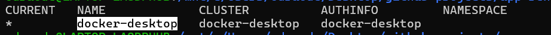
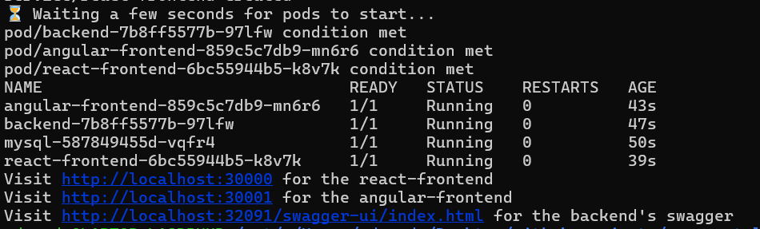
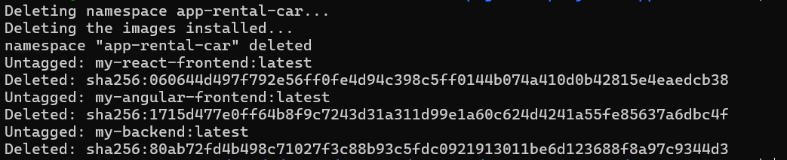
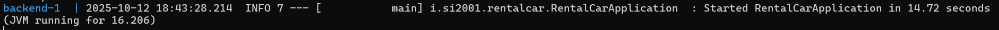
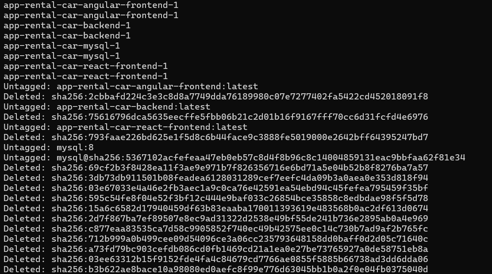

# app-rental-car

Kubernetes-deployed modular application with separate backend, frontends, and database services. Because there are submodules to clone the project you must execute 
```
git clone --recurse-submodules https://github.com/LVisir/app-rental-car.git
```

## Table of Contents

 - [General Info](#general-info)
 - [Introduction](#introduction)
 - [Technologies](#technologies)
 - [Setup](#setup)
 - [Docker setup (no k8s)](#docker-setup)
 - [Recap](#recap)
 - [Links](#-links)


## General Info

This educational project aim is to show how a kubernetes application is organized. There are three deployments each refers to a [backend](https://github.com/LVisir/spring-rental-car), an [angular-frontend](https://github.com/LVisir/angular-rental-car), a [react-frontend](https://github.com/LVisir/react-rental-car) and a stateless mysql database; there are services to allow the communication between the pods and a configmap that serve to generate the tables and the data inside the database. You need docker desktop with his local k8s cluster to make this work.

Because there are submodules to clone the project you must execute 
```
git clone --recurse-submodules https://github.com/LVisir/app-rental-car.git
```

## Introduction

The project contains three submodules fetched from three existing projects: the [spring-rental-car](https://github.com/LVisir/spring-rental-car), the [angular-rental-car](https://github.com/LVisir/angular-rental-car) and the [react-rental-car](https://github.com/LVisir/react-rental-car). For more info please visit the appropriate page. In summary, the application is a rental car system. Each user can rent a car and an admin can approve the bookings. The goal of the project is to have an easy ready-to-use kubernetes application to study how a normal production cloud software are organized. You need docker desktop with his local k8s cluster to make this work.

Because there are submodules to clone the project you must execute 
```
git clone --recurse-submodules https://github.com/LVisir/app-rental-car.git
```
## Technologies
- Spring 2.6.3
- Java 17
- MySQL 8
- Docker
- Angular 13.2.6
- React 17.0.2
# Setup
Tested in the local cluster of ```docker-desktop```. Check here: [how to have a local cluster with docker desktop](https://www.docker.com/blog/how-to-set-up-a-kubernetes-cluster-on-docker-desktop/), with docker desktop you can have a ready k8s cluster in local. If no kubernetes is installed but only docker there is also a command to create and start the app just with containers ([check below](#docker-setup)). Don't worry if your local cluster ```docker-desktop``` will get modify because by executing the command below it will create a totally new namespace ```app-rental-car```. **Prerequisites**: port 30000, 30001, 32091 and 3306 must be free.

```
Launch Docker Desktop
```
Check that the right context is set:
```
kubectl config get-contexts
```
It must appear something like this with the dot pointing ```docker-desktop```:

```
kubectl config use-context docker-desktop
```
```
Come into the location where you want to clone the project
```
```
git clone --recurse-submodules https://github.com/LVisir/app-rental-car.git
```
```
cd app-rental-car
```
```
./deploy_k8s.sh
```


Wait for an output similar to this:




The script will create a new namespace called ```app-rental-car```. It will create the images locally from which the k8s component will fetch to create the pod. It will create 4 deployments, 4 services and a configmap. On ```http://localhost:30000``` it will run the react-frontend, on ```http://localhost:30001``` the angular-frontend and on ```http://localhost:32091/swagger-ui/index.html``` you will see the swagger of the backend. 


SUPERUSER credentials:
```
test@gmail.com
```
```
1234
```

CUSTOMER credentials:
```
caccamo@gmail.com
```
```
1234
```


To clean all the things installed just run:

```
./clean_k8s.sh
```


After seeing something like this the namespace are erased with all the things inside and also the images used:



## Docker setup (no k8s)
If you don't have kubernetes but just docker, run this other script below. **Prerequisites**: port 3000, 4200, 32091 and 3306 must be free:
```
./deploy_docker.sh
```

After seeing something like this the application is ready-to-use:



On ```http://localhost:3000``` it will run the react-frontend, on ```http://localhost:4200``` the angular-frontend and on ```http://localhost:32091/swagger-ui/index.html``` you will see the swagger of the backend.

To clean the docker containers and images just run ```./clean_deploy_docker.sh```.

After seeing something like this the docker environment are cleaned from what you installed:




## Recap
In summary, this is a modular, Kubernetes-deployed application for managing a rental car service. It consists of:

 - Backend Service – Spring Boot application handling business logic, authentication, and database access.

 - Frontend Applications – Angular and React frontends providing separate user interfaces for customers and administrators.

 - Database Service – MySQL storing users, bookings, and vehicles data.

Each component runs in its own pod, communicating via internal service URLs. The architecture allows independent deployment and scaling of each component.

Key Features:

 - REST APIs for all backend operations

 - Multiple frontend clients

 - Dockerized and Kubernetes-ready deployment

 - Modular design supporting future microservices expansion

To know better how the applications works please visit here [spring-rental-car](https://github.com/LVisir/spring-rental-car) and here [angular-rental-car](https://github.com/LVisir/angular-rental-car) or here [react-rental-car](https://github.com/LVisir/react-rental-car).

## 🔗 Links
[](https://github.com/LVisir)
[](https://www.linkedin.com/in/edoardo-mariani-2903a5262/)
